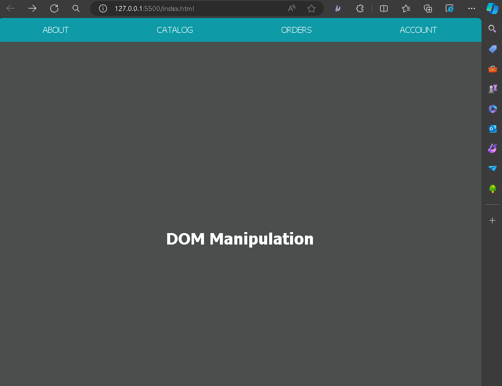

# DOM Manipulation LAB

This project demonstrates basic DOM manipulation using JavaScript. It creates a menu bar with links dynamically.

## Program Structure

The program is divided into three parts:

### Part 1: Getting Started

This part selects the `<main>` element and modifies its properties. It sets the background color, inner HTML, and adds a class to it.

### Part 2: Creating a Menu Bar

This part selects the `<nav id="top-menu">` element and modifies its properties. It sets the height, background color, and adds a class to it.

### Part 3: Adding Menu Buttons

This part iterates over the `menuLinks` array, which contains link objects with `text` and `href` properties. For each link object, it creates an `<a>` element, sets its `href` attribute and content, and appends it to the `<nav>` element.

## Usage

To use this program, include it in a HTML file with a `<main>` and `<nav id="top-menu">` element. The program will dynamically create a menu bar based on the `menuLinks` array.

## Customization

You can customize the menu bar by modifying the `menuLinks` array. Each object in the array represents a link in the menu bar, with `text` property as the display text and `href` property as the link URL.

## Preview of lab
